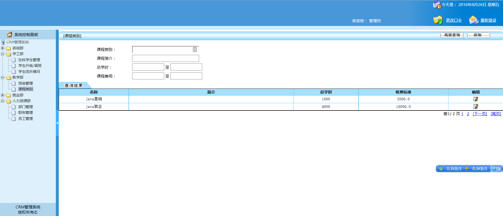

##整合SSH——CRM

截图：

主要实现：

*  完成登录和登录拦截
*  完成查询所有员工功能
*  完成员工基本信息回显
*  完成部门和职务的回显
*  完成部门和职务的ajax编辑选择
*  完成员工信息修改后的提交
*  完成（课程类别的所有查询）
*  完成（课程的条件查询和添加更新功能）
*  完成（带条件的分页功能）
*  完成（BaseDao类的功能）
*  完成（BaseAction类的功能）
*  完成（班级查询所有）
*  完成（课表文件上传）
 
 
 
 源代码：
 ScreenShot/ee19_crm_11_classes_upload.zip